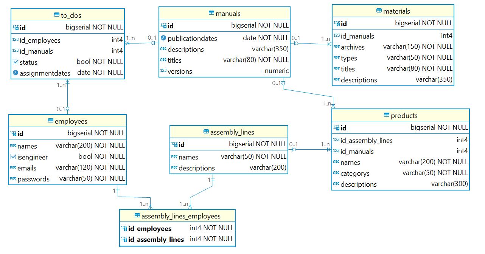

# Modelo do Banco de Dados

&nbsp;&nbsp;&nbsp;&nbsp;O principal modelo adotadado no que tange à modelagem de dados é o físico, o qual engloba as relações principais entre as entidades, incluindo chaves estrangeiras e primárias para garantir a integridade referencial dos dados. Ademais, contempla a definição das tipagens dos dados, especificando os tipos de dados atribuídos a cada campo das tabelas, delineando, assim, a estrutura e organização fundamentais do banco de dados e a tornando precisa e coerente, mantendo a organização intrínseca do banco de dados.

&nbsp;&nbsp;&nbsp;&nbsp;Depois de conversar com nossos parceiros ao final de duas *sprints*, entendemos que precisaríamos guardar muitas informações diferentes em um banco de dados, o qual é composto de várias tabelas e relacionamentos. Essas informações foram divididas em seis entidades (tabelas): materiais dos manuais, manuais, produtos, funcionários, linhas de montagem e listas de tarefas. Essas são as partes principais do nosso banco de dados, que está passível de alterações conforme nosso projeto evoluir e obtivermos um maior entendimento do negócio. Abaixo está um esquema mostrando como é o nosso banco de dados, com detalhes sobre quantas informações podemos guardar, se algumas informações podem ser deixadas em branco e que tipo de dados podemos guardar.

<div align="center">
<sub>Figura 1 - Esquema do Banco de Dados</sub>

<sup>Fonte: Material elaborado pelo autor (2024).</sup>
</div>

[Imagem em PNG](assets/imagemBD.png)
[Modelo em XML](assets/modelagem.xml)

***Tabela MANUALS:***


&nbsp;&nbsp;&nbsp;&nbsp;Esta tabela armazena informações sobre os manuais utilizados para o aprendizado da montagem de produtos. Cada manual é identificado por um ID único, que é um número inteiro sequencial. As datas de publicação são armazenadas como tipos de dados DATE. As descrições dos manuais são armazenadas em campos do tipo VARCHAR, permitindo até 350 caracteres. Os títulos dos manuais são campos do tipo VARCHAR, com um limite de até 80 caracteres, e possuem um valor padrão de 'Sem Título' quando não especificados. As versões dos manuais são representadas por números decimais, armazenados como tipos de dados DECIMAL, com um valor padrão de 0.1.
- **Cardinalidade:** Um manual pode estar associado a muitos itens de tarefas (TO-DOS), pois vários funcionários podem ter a mesma tarefa de ler um manual. 

***Tabela EMPLOYEES:***

&nbsp;&nbsp;&nbsp;&nbsp;Esta entidade mantém registros de todos os funcionários da empresa, incluindo engenheiros e operadores de linha de montagem. Cada funcionário é identificado por um ID único, que é um número inteiro sequencial. Os nomes dos funcionários são armazenados em campos do tipo VARCHAR, com um limite de até 200 caracteres. O campo IsEngineer é do tipo BOOLEAN, representando se o funcionário é ou não um engenheiro. Os e-mails e senhas dos funcionários são armazenados em campos do tipo VARCHAR, com limites de até 120 e 50 caracteres, respectivamente.
- **Cardinalidade:** Um funcionário pode ter muitas tarefas (TO-DOS), pois pode ser atribuído a ler vários manuais. Um funcionário também pode estar associado a várias linhas de montagem (ASSEMBLY_LINES) através da tabela de associação muitos para muitos (ASSEMBLY_LINES__EMPLOYEES).

***Tabela ASSEMBLY_LINES:***

&nbsp;&nbsp;&nbsp;&nbsp;Nesta tabela são armazenadas informações sobre as linhas de montagem às quais os funcionários estão associados. Cada linha de montagem é identificada por um ID único, que é um número inteiro sequencial. Os nomes das linhas de montagem são armazenados em campos do tipo VARCHAR, com um limite de até 50 caracteres. As descrições opcionais das linhas de montagem são armazenadas em campos do tipo VARCHAR, com um limite de até 200 caracteres.
- **Cardinalidade:** Uma linha de montagem pode estar associada a muitos funcionários, e vice-versa. Isso é estabelecido através da tabela de associação muitos para muitos (ASSEMBLY_LINES__EMPLOYEES).

***Tabela TO-DOS:***

&nbsp;&nbsp;&nbsp;&nbsp;Esta entidade registra as tarefas de leitura de manuais atribuídas aos funcionários. Cada tarefa é identificada por um ID único, que é um número inteiro sequencial. Os IDs dos funcionários e dos manuais associados são armazenados como chaves estrangeiras, referenciando as chaves primárias das tabelas EMPLOYEES e MANUALS, respectivamente. O status da tarefa é representado por um campo do tipo BOOLEAN, indicando se a tarefa foi concluída ou não. As datas de atribuição das tarefas são armazenadas como tipos de dados DATE.
- **Cardinalidade:** Um item de tarefa (TO-DO) está associado a um único funcionário e a um único manual. Um funcionário pode ter muitos itens de tarefa.

***Tabela ASSEMBLY_LINES__EMPLOYEES:***

&nbsp;&nbsp;&nbsp;&nbsp;Esta tabela serve como uma tabela de associação muitos para muitos entre as tabelas de linhas de montagem e funcionários. Ela armazena os IDs dos funcionários e das linhas de montagem associados a eles, ambos como chaves estrangeiras referenciando as chaves primárias das tabelas EMPLOYEES e ASSEMBLY_LINES, respectivamente.
- **Cardinalidade:** Um funcionário pode estar associado a muitas linhas de montagem, e uma linha de montagem pode ter muitos funcionários associados.

***Tabela PRODUCTS:***

&nbsp;&nbsp;&nbsp;&nbsp;Nesta tabela são registrados os produtos montados pela empresa. Cada produto é identificado por um ID único, que é um número inteiro sequencial. Os IDs dos manuais e das linhas de montagem associadas ao produto são armazenados como chaves estrangeiras, referenciando as chaves primárias das tabelas MANUALS e ASSEMBLY_LINES, respectivamente. Os nomes dos produtos são armazenados em campos do tipo VARCHAR, com um limite de até 200 caracteres. As categorias dos produtos são representadas por campos do tipo VARCHAR, com um limite de até 50 caracteres. As descrições opcionais dos produtos são armazenadas em campos do tipo VARCHAR, com um limite de até 300 caracteres.
- **Cardinalidade:** Um produto está associado a um único manual e a uma única linha de montagem. Um manual e uma linha de montagem podem estar associados a muitos produtos.

***Tabela MATERIALS:***

&nbsp;&nbsp;&nbsp;&nbsp;Esta entidade mantém os arquivos utilizados nos manuais. Cada material é identificado por um ID único, que é um número inteiro sequencial. Os IDs dos manuais associados aos materiais são armazenados como chaves estrangeiras, referenciando as chaves primárias da tabela MANUALS. Os caminhos para os arquivos são armazenados em campos do tipo VARCHAR, com um limite de até 150 caracteres. Os tipos de arquivos (PDF, vídeo, modelo 3D, etc.) são representados por campos do tipo CHAR, com um limite de até 50 caracteres. Os títulos e descrições opcionais dos materiais são armazenados em campos do tipo VARCHAR, com limites de até 80 e 350 caracteres, respectivamente.
- **Cardinalidade:** Um material está associado a um único manual. Um manual pode ter muitos materiais associados.

&nbsp;&nbsp;&nbsp;&nbsp;Portanto, observa-se que a modelagem física estabelece as bases para a integridade e a precisão dos dados. A definição das relações entre as entidades, juntamente com a especificação dos tipos de dados e a atribuição de chaves primárias e estrangeiras, garante a consistência dos dados e a integridade referencial. Além disso, a modelagem física facilita a otimização do desempenho do banco de dados, tornando mais eficiente o acesso e manipulação dos dados.

**OBS**: o código deve ser executado linha a linha para que funcione de maneira adequada. Caso esteja usando o *DBeaver* selecione todo o código e pressione as teclas `ALT + X` para executá-lo linha a linha.

```SQL
CREATE TABLE EMPLOYEES (
 id BIGSERIAL PRIMARY KEY,
 Names VARCHAR(200) NOT NULL DEFAULT 'NULL',
 IsEngineer BOOLEAN NOT NULL DEFAULT FALSE,
 Emails VARCHAR(120) NOT NULL DEFAULT 'NULL',
 Passwords VARCHAR(50) NOT NULL DEFAULT 'NULL'
);
COMMENT ON TABLE EMPLOYEES IS 'Tabela que armazenará todos os funcionários da empresa';
COMMENT ON COLUMN EMPLOYEES.IsEngineer IS 'Campo binário para definição se é engenheiro ou não';

CREATE TABLE MANUALS (
 id BIGSERIAL PRIMARY KEY,
 PublicationDates DATE NOT NULL DEFAULT CURRENT_DATE,
 Descriptions VARCHAR(350),
 Titles VARCHAR(80) NOT NULL DEFAULT 'Sem Título',
 Versions DECIMAL DEFAULT 0.1
);
COMMENT ON TABLE MANUALS IS 'Manuais para o aprendizado da montagem de produtos';

CREATE TABLE ASSEMBLY_LINES (
 id BIGSERIAL PRIMARY KEY,
 Names VARCHAR(50) NOT NULL DEFAULT 'NULL',
 Descriptions VARCHAR(200) DEFAULT 'Sem descrição'
);
COMMENT ON TABLE ASSEMBLY_LINES IS 'Armazenará as linhas de montagens das quais os funcionários são pertencentes.';

CREATE TABLE PRODUCTS (
 id BIGSERIAL PRIMARY KEY,
 id_ASSEMBLY_LINES INTEGER,
 id_MANUALS INTEGER,
 Names VARCHAR(200) NOT NULL DEFAULT 'NULL',
 Categorys VARCHAR(50) NOT NULL DEFAULT 'NULL',
 Descriptions VARCHAR(300) DEFAULT 'Sem descrição',
 CONSTRAINT fk_PRODUCTS_id_ASSEMBLY_LINES FOREIGN KEY (id_ASSEMBLY_LINES) REFERENCES ASSEMBLY_LINES(id),
 CONSTRAINT fk_MANUALS FOREIGN KEY (id_MANUALS) REFERENCES MANUALS(id)
);
COMMENT ON TABLE PRODUCTS IS 'Equipamentos montados pela Dell';
COMMENT ON COLUMN PRODUCTS.Categorys IS 'Exemplo: monitor, notebook, servidor, etc.';

CREATE TABLE MATERIALS (
 id BIGSERIAL PRIMARY KEY,
 id_MANUALS INTEGER,
 Archives VARCHAR(150) NOT NULL DEFAULT 'NULL',
 Types VARCHAR(50) NOT NULL DEFAULT 'NULL',
 Titles VARCHAR(80) NOT NULL DEFAULT 'Sem Título',
 Descriptions VARCHAR(350) DEFAULT 'Sem descrição',
 CONSTRAINT fk_MATERIALS_id_MANUALS FOREIGN KEY (id_MANUALS) REFERENCES MANUALS(id)
);
COMMENT ON TABLE MATERIALS IS 'Arquivos que serão utilizados nos manuais';
COMMENT ON COLUMN MATERIALS.Archives IS 'Caminho para o material';
COMMENT ON COLUMN MATERIALS.Types IS 'Campo para informar a extensão do arquivo do manual (PDF, vídeo, modelo 3D, etc)';

CREATE TABLE ASSEMBLY_LINES_EMPLOYEES (
 id_EMPLOYEES INTEGER,
 id_ASSEMBLY_LINES INTEGER,
 PRIMARY KEY (id_EMPLOYEES, id_ASSEMBLY_LINES),
 CONSTRAINT fk_ASSEMBLY_LINES_EMPLOYEES_id_EMPLOYEES FOREIGN KEY (id_EMPLOYEES) REFERENCES EMPLOYEES(id),
 CONSTRAINT fk_ASSEMBLY_LINES_EMPLOYEES_id_ASSEMBLY_LINES FOREIGN KEY (id_ASSEMBLY_LINES) REFERENCES ASSEMBLY_LINES(id)
);
COMMENT ON TABLE ASSEMBLY_LINES_EMPLOYEES IS 'Intermédio entre as tabelas de linha de montagem e a tabela de funcionários por conta da relação n pra n';

CREATE TABLE TO_DOS (
 id BIGSERIAL PRIMARY KEY,
 id_EMPLOYEES INTEGER,
 id_MANUALS INTEGER,
 Status BOOLEAN NOT NULL DEFAULT FALSE,
 AssignmentDates DATE NOT NULL DEFAULT CURRENT_DATE,
 CONSTRAINT fk_TO_DOS_id_EMPLOYEES FOREIGN KEY (id_EMPLOYEES) REFERENCES EMPLOYEES(id),
 CONSTRAINT fk_TO_DOS_id_MANUALS FOREIGN KEY (id_MANUALS) REFERENCES MANUALS(id)
);
COMMENT ON TABLE TO_DOS IS 'Lista de manuais a serem lidos pelo funcionário';
COMMENT ON COLUMN TO_DOS.Status IS 'Campo binário para definir se a tarefa foi concluída ou não';
